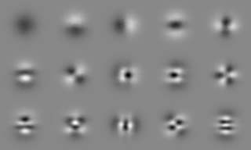
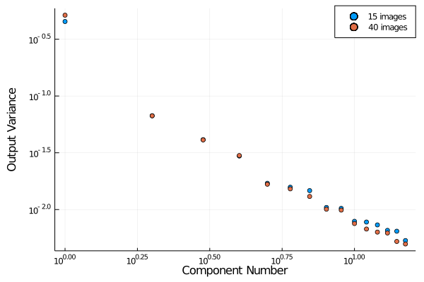
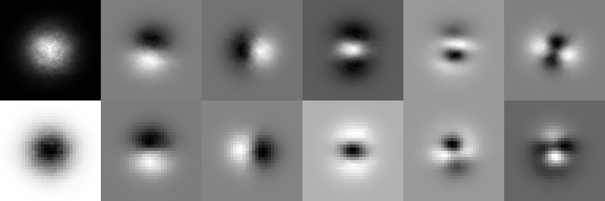
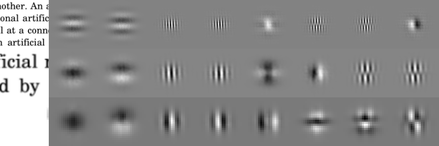
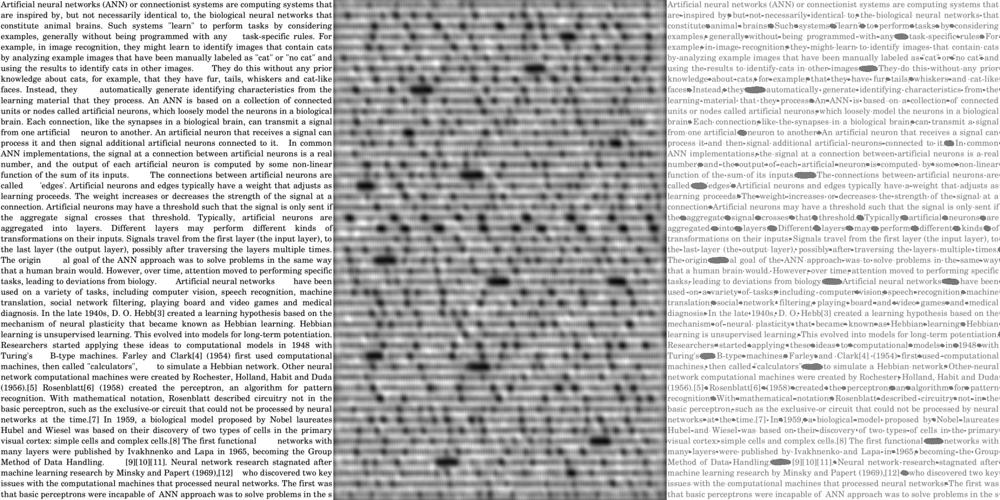

---
jupyter:
  jupytext:
    text_representation:
      extension: .md
      format_name: markdown
      format_version: '1.1'
      jupytext_version: 1.1.0
  kernelspec:
    display_name: Julia 1.4.2
    language: julia
    name: julia-1.4
---


# Introduction


Add the packages that we require for this session:

```julia
using ImageFiltering
using Plots
using Images
using ImageMagick
using Printf
using LinearAlgebra             # for norm(.)
using Statistics       
```


## Include the source code

```julia
include("hancock.jl")
```


## Figure 1

```julia
PlotFigure1()
plot(load("julia-fig1.png"))
```

## Figure 2


```julia
PlotFigure2()
plot(load("julia-fig2.png"))
```

## Figure 3


```julia
PlotFigure3()
```

Here is the figure:



## Figure 4


```julia
PlotFigure4()
```

Here is the figure:


## Figure 5


```julia
PlotFigure5()
```

Here is the figure:



## Figure 6


```julia
PlotFigure6()
```

Here is the figure:



## Figure 7


```julia
PlotFigure7()
```

Here is the figure:



## Figure 8


```julia
PlotFigure8()
```

Here is the figure:



## Notes

Convert the markdown using `jupytext --to notebook  test.md`

launch the notebook using `jupyter notebook test.ipynb`

Get the list of kernelspecs using `jupyter kernelspec list`; to add
the Julia kernel, add the IJulia package for that version of Julia.


